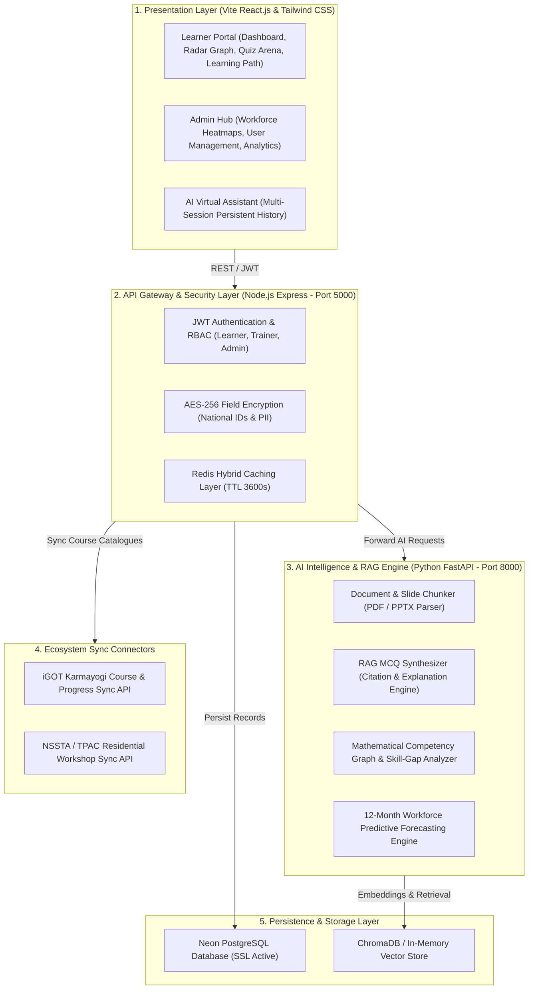

# 🇮🇳 SAKSHAM AI — Skill Intelligence & Learning Platform
### *AI-Enabled Competency Assessment, Skill-Gap Analytics & Personalized Training Engine for India's Official Statistical System*

[](https://sih.gov.in)
[](https://mospi.gov.in)
[](#)
[](#)
[](#)

---

##  Project Overview & Problem Statement

India's statistical system is undergoing rapid technological transformation with increasing adoption of Artificial Intelligence (AI), Machine Learning (ML), Big Data Analytics, GIS, cloud computing, and modern survey methodologies. Officials across the **Ministry of Statistics & Programme Implementation (MoSPI)**, **Central Statistics Office (CSO)**, **National Sample Survey Office (NSSO)**, and state directorates require continuous capacity building to meet evolving national data needs.

While the **iGOT Karmayogi** platform provides a vast repository of digital learning resources, officials often struggle to identify courses aligned with their specific job roles, existing competencies, and career progression.

**Saksham AI** addresses this gap by providing an end-to-end **AI-powered Skill Intelligence and Learning Platform** tailored specifically for professionals in Official Statistics.

###  Institutional Metadata
* **Organization:** Ministry of Statistics & Programme Implementation (MoSPI)
* **Department:** Data Informatics & Innovation Division (DIID) & NSSTA Greater Noida
* **Theme:** Smart Education
* **Category:** Software
* **Datasets & Ecosystems:** `mospi.gov.in`, `nssta.gov.in`, `iGOT Karmayogi`, `TPAC`

---

##  Key Platform Capabilities

| Capability | Technical Description | SIH Problem Alignment |
| :--- | :--- | :--- |
|  **AI Competency Profiling** | Evaluates baseline proficiency across 4 official domains (*Statistical Methods, SNA 2008 Accounts, Python/R, DPDPA Governance*). | *Automated Competency Framework Mapping* |
|  **Mathematical Skill-Gap Engine** | Calculates weighted competency deficits ($\Delta = Benchmark - Current$) and renders interactive 7-axis Recharts Radar Charts. | *Automated Skill-Gap Analysis* |
|  **Dual iGOT & NSSTA Sync** | Synchronizes online e-learning modules from **iGOT Karmayogi** and residential workshop schedules from **NSSTA / TPAC**. | *Seamless iGOT & NSSTA Integration* |
|  **RAG Assessment & MCQ Generator** | Parses uploaded PDFs/notes to synthesize 4-option MCQs with difficulty tags, explanations, and official manual citations. | *AI-Powered Assessment Engine* |
|  **AI Virtual Learning Assistant** | Provides a multi-session conversational interface for instant domain-specific guidance (SNA 2008, Sampling, Python/R). | *Real-Time Learner Support* |
|  **Interactive Dual Dashboards** | • **Learner:** Dynamic radar charts, priority gaps, persistent course progress, certificates.<br>• **Administrator:** Workforce heatmaps, 12-month predictive trends, report exports. | *Learner & Administrator Dashboards* |
|  **Instant Self-Registration** | Public registration creates auto-activated accounts immediately with custom user passwords. | *Role-Based Access Control (RBAC)* |
|  **Self-Service Password Recovery** | 6-digit OTP verification mechanism allowing secure credential recovery. | *DPDPA 2023 Compliant Authentication* |

---

##  Competency Domain Architecture

```
                                    ┌──────────────────────────────────────────────┐
                                    │    MoSPI Official Competency Framework       │
                                    └──────────────────────┬───────────────────────┘
                                                           │
         ┌─────────────────────────┬───────────────────────┴───────────────────────┬─────────────────────────┐
         ▼                         ▼                                               ▼                         ▼
┌───────────────────┐    ┌───────────────────┐                           ┌───────────────────┐     ┌───────────────────┐
│ Statistical (1.0) │    │  Technical (1.0)  │                           │ Digital Gov (0.9) │     │ Leadership (0.85) │
├───────────────────┤    ├───────────────────┤                           ├───────────────────┤     ├───────────────────┤
│ • Survey Sampling │    │ • Python & R Dev  │                           │ • DPDPA 2023      │     │ • Policy Advisory │
│ • SNA 2008 (GDP)  │    │ • AI in Microdata │                           │ • Confidentiality │     │ • Inter-Agency    │
│ • CPI / WPI Index │    │ • CAPI & Big Data │                           │ • Open Data Dissem│     │ • Survey Direction│
└───────────────────┘    └───────────────────┘                           └───────────────────┘     └───────────────────┘
```

---

## 7-Tier System Architecture



---

## Pre-Configured Demo Personas

The platform includes 1-click quick login buttons for all evaluation personas:

| Persona | Name & Cadre | Role | Official Email | Default Password |
| :--- | :--- | :--- | :--- | :--- |
| **Learner (SSO)** | **Arjun Sharma, ISS** | `role_learner` | `arjun.sharma@mospi.gov.in` | `Saksham@2026` |
| **Learner (JSO)** | **Priya Deshmukh, SSS** | `role_learner` | `priya.deshmukh@mospi.gov.in` | `Saksham@2026` |
| **Trainer / Faculty**| **Dr. Radhika Sen, ISS** | `role_trainer` | `radhika.sen@nssta.gov.in` | `Saksham@2026` |
| **System Admin** | **Rajesh K. Verma, ISS** | `role_sysadmin`| `rajesh.verma@mospi.gov.in` | `Saksham@2026` |

*Note: Any newly registered user on `/register` can set their own custom password and is activated immediately.*

---

## Quick Start & Running Locally

### Prerequisites
* **Node.js**: v18+ 
* **Python**: v3.10+
* **Git**

### Step-by-Step Setup

#### 1. Start Python AI Microservice (Port 8000)
```bash
cd backend/ai_service
pip install -r requirements.txt
python -m uvicorn main:app --host 127.0.0.1 --port 8000 --reload
```
*Interactive Swagger API Docs available at:* **[http://127.0.0.1:8000/docs](http://127.0.0.1:8000/docs)**

#### 2. Start Node.js API Gateway (Port 5000)
```bash
cd backend/gateway_service
npm install
npm start
```
*Gateway Health status available at:* **[http://localhost:5000/health](http://localhost:5000/health)**

#### 3. Start Frontend Portal (Port 3000)
```bash
cd frontend
npm install
npm run dev
```
*Open in Browser:* **[http://localhost:3000](http://localhost:3000)**

---

##  Security, Compliance & Data Governance

* **AES-256-CBC Encryption:** Sensitive identifiers such as Aadhaar and PAN numbers are encrypted at the field level before database persistence.
* **DPDPA 2023 Alignment:** Compliant with India's Digital Personal Data Protection Act and National Data Sharing Guidelines.
* **Parichay SSO Ready:** Built with Single Sign-On hooks for National Informatics Centre (NIC) Parichay and Jan Parichay gateways.
* **Statutory Confidentiality:** Implements cell suppression and microdata privacy principles following the **UN Fundamental Principles of Official Statistics**.

---

##  License & Attribution
Developed for **Smart India Hackathon (SIH) 2026** under the **Ministry of Statistics & Programme Implementation (MoSPI)** problem statement.
All rights reserved © 2026 404 not founders Team.
